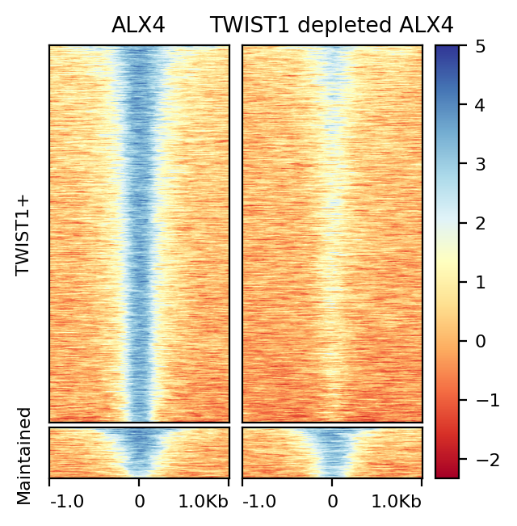
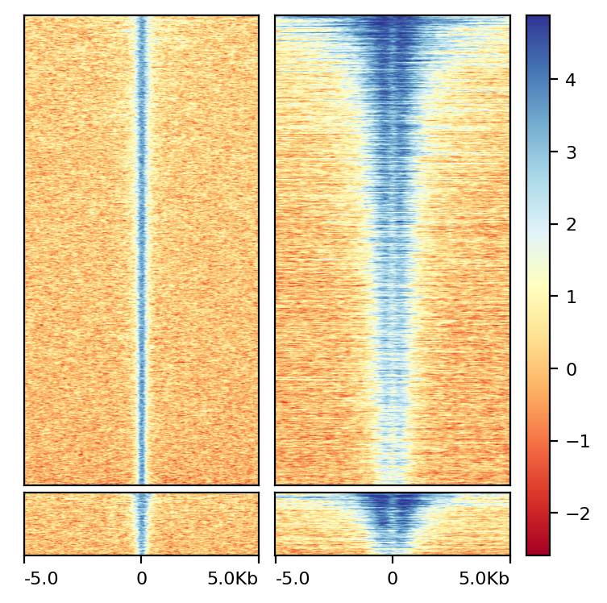
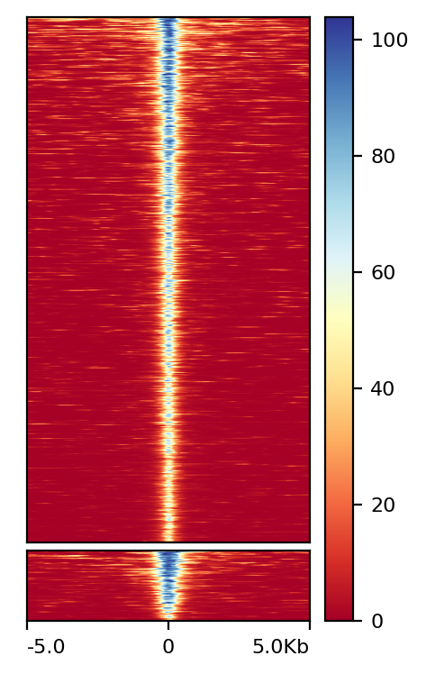

# Table of Contents
1. [Pre-processing data](#pre-processing-the-data)
2. [Bigwig and heatmap generation](#post-processing-of-alx4-cutrun)
3. [Footprinting analysis](#footprinting-analysis)

This document details and documents the analysis, but is not meant for reproducible runs. 

# ALX4 analysis

**Goals**

1. Identify key enhancers
2. Determine TWIST1 independent and dependent ALX4 bound regions
3. Determine gene regulatory function of ALX4 cooperativity

# Pre-processing the data 

All ChIP-seq, CUT&RUN, and ATAC-seq needs to follow the below processing steps. 

1. Download 
2. Adapter trimming
3. Undergo quality control scoring
4. Align to the hg19 genome
5. Deduplicated
6. Final alignment sorting

## Dataset submission details

| Assay type | Pulldown | TWIST1 depleted | Replicate | GSM ID | SRR ID | Cell line |
----------|------|--|---|------------|-------------|---------------------------- 
| CUT&RUN | ALX4 |  | 1 | GSM7213748 | SRR24258480 | TWIST1FV |
| CUT&RUN | TWIST1 |  | 1 | GSM7213747 | SRR24258481 | TWIST1FV |
| CUT&RUN | IgG |  | 1 | GSM7213753 | SRR24258475 | TWIST1FV |
| CUT&RUN | ALX4 | YES | 1 | GSM7213755 | SRR24258473 | TWIST1FV |
| CUT&RUN | IgG | YES | 1 | GSM7213760 | SRR24258468 | TWIST1FV |
| ChIP | H3K27ac |  | 1 | GSM7213607 | SRR24257082 | TWIST1FV |
| ChIP | H3K27ac |  | 2 | GSM7213610 | SRR24257081 | TWIST1FV |
| ChIP | IgG |  | 1 | GSM7213617 | SRR24257051 | TWIST1FV |
| ChIP | IgG |  | 2 | GSM7213620 | SRR24257016 | TWIST1FV |
| ATAC |  |  | 1 | GSM7213525 | SRR24257841 | TWIST1FV |
| ATAC |  |  | 2 | GSM7213528 | SRR24257838 | TWIST1FV |
| ATAC |  | YES | 1 | GSM7213526 | SRR24257840 | TWIST1FV |
| ATAC |  | YES | 2 | GSM7213529 | SRR24257837 | TWIST1FV |


## Pre-processing code

Job LSF submission: 

```bash
submitArrayJobs -n 4 -M 32000 -W 8:00 -A ../ALX4_submission_array -C ../ALX4_submission_command
```

Command: 

```bash
bash /scratch/cainu5/ALX4/ALX4_preprocessing.sh -a VAR4 -e VAR1 -g hg19
```

### [ALX4_preprocessing.sh](ALX4_preprocessing.sh)

``` bash
#!bin/bash

# (( TRACE )) && set -x
# set -eo pipefail
# trap 'Something went wrong. Script error on line #$LINENO."' ERR
# Processes files from GEO to mapping step


## Grab important file paths
BASEDIR="$(pwd)"
CODEDIR="$( cd "$( dirname "${BASH_SOURCE[0]}" )" >/dev/null 2>&1 && pwd )"
GENOMES="/data/campbell-gebelein-lab/Genomes/"

## COSMO variables
THRES=0.8
DIST=10

## Load modules
module load fastqc/0.11.2
module load sratoolkit/3.0.0
module load trimgalore/0.6.6
## Trim galore brings all sorts of unneccesary dependSRRies
module load bowtie2/2.3.4.1
module load samtools/1.9.0
module load homer/4.9
module load picard/2.18.22
module load bedtools/2.27.0

## Grab necessary arguments
pflag=''
while getopts ":a:b:c:d:e:g:" opt; do
	case $opt in
	a)
		REP1_SRR=${OPTARG}
		echo "$REP1_SRR"
		[[ "$REP1_SRR" == SRR* ]] || 
		echo "	[-a] Enter SRR accession for replicate 1" 
		;;
	b)
		REP2_SRR=${OPTARG}
		[[ "$REP2_SRR" == SRR* ]] || 
		echo "	[-b] Enter SRR accession for replicate 2 if applicable"
		;;
	c)
		INPUT1_SRR=${OPTARG}
		[[ "$INPUT1_SRR" == SRR* ]] || 
		echo "	[-c] Enter SRR accession for input replicate 1 if applicable"
		;;
	d)
		INPUT2_SRR=${OPTARG}
		[[ "$INPUT2_SRR" == SRR* ]] || 
		echo "	[-d] Enter SRR accession for input replicate 2 if applicable"
		;;
	e)
		EXP_name=${OPTARG}
		;;
	g)
		genome=${OPTARG}
		[[ "$genome" == hg* || "$genome" == mm* || "$genome" == dm* ]] ||
		echo "	[-g] Enter a valid genome to align to such as hg19, mm10...
		Default is mm10"
		;;
	?)
		echo 	
		"Script usage:
		
		Summary:
		Processes ChIP-seq or CUT&RUN data for dimer motifs analysis. 
		Accepts up to 2 IP and input SRR ID's and processes files up 
		to de novo motif analysis and COSMO analysis.
		
		Pipeline:
		1. Downloads files with fastq-dump
		2. Trims with trim-galore (powered by cut-adapt)
		3. FASTQC check
		4. Reads aligned with Bowtie2
		5. Duplicates removed with Picard
		6. Calls peaks with Homer
		7. Filters out peaks that fall into SRRODE blacklist
		8. Performs de novo motif analysis with Homer
		
		Program file inputs: 
		[-a] Enter SRR accession for replicate 1
		[-b] Enter SRR accession for replicate 2 if applicable
		[-c] Enter SRR accession for input replicate 1 if applicable
		[-d] Enter SRR accession for input replicate 2 if applicable
		[-e] Enter Experiment name. Default is ANALYSIS_FILE
		[-g] Enter a valid genome to align to such as hg19, mm10..."
		exit 1
		;;
	esac
done

shift $((OPTIND-1))
	
## Set up working directory
if [ ! -z ${EXP_name+x} ]
then
	mkdir -p "$EXP_name"; 
else
	mkdir 'ANALYSIS_FILE'; EXP_name='ANALYSIS_FILE'
fi

## Check for index files for genome; prep if required
if [ -z ${genome+x} ]
then
	echo "No genome selected. Will align to mm10. If this is not correct,
	CTRL+C now!"
	genome=mm10
fi

if [ -d "$GENOMES"/"$genome"/BowtieIndex ]
then
	echo "Bowtie index files exist!"
else
	echo "Generating Bowtie index files..."
	cd "$GENOMES"/"$genome" || echo 'Is the genome downloaded?'
	if [ -e "$genome".fa.gz ]
	then
		gzip -d "$genome".fa.gz
	fi
	bowtie2-build -f "$genome".fa "$genome"
	mkdir BowtieIndex
	mv *.bt2 BowtieIndex
fi
	
# Process individual fastq's
for File in "$REP1_SRR" "$REP2_SRR" "$INPUT1_SRR" "$INPUT2_SRR" 
do

	if [[ "$File" == SRR* ]]
	then
		cd "$BASEDIR"/"$EXP_name"
		echo "
	
		Starting to process $File...
		"
		# Download files
		mkdir "$File"; 
		cd "$File"
		fastq-dump --split-files --gzip "$File"
		pe=$(find ./*_2.fastq.gz 2> /dev/null | wc -l) || pe=0
		
		if [ "$pe" -gt 0 ]
		then
			### PAIRED END SEQUSRRING ###
			
			# ## Trim sequSRRes and QC	
			echo "Trimming $REP1_SRR..."
			trim_galore --fastqc --paired --cores 4 \
				"$File"_1.fastq.gz "$File"_2.fastq.gz > \
				"$File"_trim_galore_run.log
			
			mkdir Fastqc; mv -f *fastqc* Fastqc
			
			# ## Align to genome
			echo "Aligning $REP1_SRR to genome..."
			bowtie2 -x "$GENOMES"/"$genome"/BowtieIndex/"$genome" \
				--local --very-sensitive-local --no-unal --no-mixed \
				--no-discordant --threads 4 \
				-1 "$File"_1_val_1.fq.gz -2 "$File"_2_val_2.fq.gz \
				-S "$File".sam 

		else
			### SINGLE END SEQUSRRING ###
			echo "Trimming $REP1_SRR..."
			trim_galore --fastqc  --cores 4 \
				"$File"_1.fastq.gz > \
				"$File"_1_trim_galore_run.log
			
			mkdir Fastqc; mv -f *fastqc* Fastqc
			
			echo "Aligning $REP1_SRR to genome..."
			bowtie2 -x "$GENOMES"/"$genome"/BowtieIndex/"$genome" \
				--local --very-sensitive-local --no-unal --no-mixed \
				--no-discordant --threads 4 \
				-U "$File"_1_trimmed.fq.gz \
				-S "$File".sam 

		fi
				
		samtools view -b -o "$File".bam "$File".sam && rm "$File".sam
		samtools sort -o "$File".sort.bam "$File".bam && rm "$File".bam
		picard MarkDuplicates I="$File".sort.bam O="$File".marked.bam REMOVE_DUPLICATES=false M="$File"_rmdup.log
		samtools view -h -b -q 30 -F 1024 -o "$File".rmdup.bam "$File".marked.bam
		samtools index "$File".rmdup.bam 
		
	fi
done


mpurge
module load python3

bamCoverage --bam "$File".rmdup.bam \
	 -o "$File".bw \
	 --binSize 10 \
	 --normalizeUsing RPGC \
	 --effectiveGenomeSize 2800000000 \
	 --ignoreForNormalization chrX \
	 --extendReads 

```

Note: I am unable to host large files on GitHub due to size constraints, but any file is available upon request. 

# Post processing of ALX4 CUT&RUN

*python 3/3.7.1 loaded in*

1. Converted bam alignments to a normalized bigwig file
2. Called peaks
3. Separated peaks based on TWIST1 dependence
4. Plotted ALX4 binding, H3K27ac binding, and accessibility at ALX4 bound regions. 

## Call peaks for ALX4 CR, ATAC-seq, and H3K27ac data

**Code**

``` bash
## ALX4 CR peaks
macs3 callpeak -t SRR24258480.rmdup.bam \
	-c ../../IgG_CR/SRR24258475/SRR24258475.rmdup.bam \
	-f BAMPE \
	-g hs \
	-n SRR24258480 \
	--keep-dup all \
	--qvalue 0.01 \
	--nomodel \
	--call-summits \
	--SPMR

macs3 callpeak -t SRR24258473.rmdup.bam \
	-c ../../IgG_CR/SRR24258475/SRR24258468.rmdup.bam \
	-f BAMPE \
	-g hs \
	-n SRR24258473 \
	--keep-dup all \
	--qvalue 0.01 \
	--nomodel \
	--call-summits \
	--SPMR

## H3K27ac ChIP peaks
macs3 callpeak -t SRR24257081/SRR24257081.rmdup.bam SRR24257082/SRR24257082.rmdup.bam \
-c SRR24257016/SRR24257016.rmdup.bam SRR24257051/SRR24257051.rmdup.bam \
-f BAMPE \
-g hs \
-n H3K27ac_pooled \
--keep-dup all \
--qvalue 0.01 \
--nomodel \
--broad \
--broad-cutoff 0.1

## ATAC-seq
macs3 callpeak -t SRR24257838/SRR24257838.rmdup.bam \
SRR24257841/SRR24257841.rmdup.bam \
-f BAMPE \
-g hs \
-n ATAC \
--keep-dup all \
--qvalue 0.01 \
--nomodel \
--call-summits \
--SPMR \
--shift -75 \
--extsize 150
```

**Resulting output**

``` bash
# ARGUMENTS LIST:
# name = SRR24258480
# format = BAMPE
# ChIP-seq file = ['SRR24258480.rmdup.bam']
# control file = ['../../IgG_CR/SRR24258475/SRR24258475.rmdup.bam']
# effective genome size = 2.70e+09
# band width = 300
# model fold = [5, 50]
# qvalue cutoff = 1.00e-02
# The maximum gap between significant sites is assigned as the read length/tag size.
# The minimum length of peaks is assigned as the predicted fragment length "d".
# Larger dataset will be scaled towards smaller dataset.
# Range for calculating regional lambda is: 1000 bps and 10000 bps
# Broad region calling is off
# Paired-End mode is on
# Searching for subpeak summits is on

# ARGUMENTS LIST:
# name = H3K27ac_pooled
# format = BAMPE
# ChIP-seq file = ['SRR24257081/SRR24257081.rmdup.bam', 'SRR24257082/SRR24257082.rmdup.bam']
# control file = ['../IgG_ChIP/SRR24257016/SRR24257016.rmdup.bam', '../IgG_ChIP/SRR24257051/SRR24257051.rmdup.bam']
# effective genome size = 2.70e+09
# band width = 300
# model fold = [5, 50]
# qvalue cutoff for narrow/strong regions = 1.00e-02
# qvalue cutoff for broad/weak regions = 1.00e-01
# The maximum gap between significant sites is assigned as the read length/tag size.
# The minimum length of peaks is assigned as the predicted fragment length "d".
# Larger dataset will be scaled towards smaller dataset.
# Range for calculating regional lambda is: 1000 bps and 10000 bps
# Broad region calling is on
# Paired-End mode is on

# ARGUMENTS LIST:
# ARGUMENTS LIST:
# name = ATAC
# format = BAMPE
# ChIP-seq file = ['SRR24257838/SRR24257838.rmdup.bam', 'SRR24257841/SRR24257841.rmdup.bam']
# control file = None
# effective genome size = 2.70e+09
# band width = 300
# model fold = [5, 50]
# qvalue cutoff = 1.00e-02
# The maximum gap between significant sites is assigned as the read length/tag size.
# The minimum length of peaks is assigned as the predicted fragment length "d".
# Larger dataset will be scaled towards smaller dataset.
# Range for calculating regional lambda is: 10000 bps
# Broad region calling is off
# Paired-End mode is on
# Searching for subpeak summits is on
```

## ALX4 binding signal in TWIST1 + vs TWIST1- backgrounds

### Separate peaks into TWIST1 dependent and TWIST1 independent groups

``` bash
## Determine regions that are maintained in TWIST1+ and TWIST1- backgrounds
bedtools window -w 1 \ 
    -a SRR24258473_peaks.narrowPeak \
    -b ../../ALX4_CR/SRR24258480/SRR24258480_peaks.narrowPeak \
    > ALX4_Maintained.bed

## Determine regions that are only in TWIST1+ backgrounds
bedtools window -w 1 -v \ 
	-a SRR24258473_peaks.narrowPeak \
	-b ../../ALX4_CR/SRR24258480/SRR24258480_peaks.narrowPeak \
	> ALX4_TWISTpos_only_peaks.bed

```

Note, there were no peaks that were specific to the TWIST1- background. Regions were merged in excel. 

### Generate normalized big wig files with IgG controls and generate heatmaps

```bash
bamCompare --bamfile1 SRR24258480.rmdup.bam \
	--bamfile2 ../SRR24258475/SRR24258475.rmdup.bam \
	--outFileName SRR24258480_normalized2IgG_1bp.bw \
	--binSize 1 \
	--extendReads 

bamCompare --bamfile1 SRR24258473.rmdup.bam \
	--bamfile2 ../SRR24258468/SRR24258468.rmdup.bam \
	--outFileName SRR24258473_normalized2IgG_1bp.bw \
	--binSize 1 \
	--extendReads 

computeMatrix reference-point --referencePoint center \
    --regionsFileName ALX4_TWISTpos_only_peaks.bed ALX4_Maintained.bed \
    --scoreFileName ALX4_CR/SRR24258480/SRR24258480_normalized2IgG.bw 
        ALX4_CR_TWIST1_depleted/SRR24258473/ALX4_CR_TWIST1_depleted_normalized2IgG.bw \
    --outFileName Normalized_ALX4CR_all_TWIST1_v_noTWISTmaintained \
    --beforeRegionStartLength 1000 \
    --afterRegionStartLength 1000 \
    --binSize 10

plotHeatmap --matrixFile  Normalized_ALX4CR_all_TWIST1_v_noTWISTmaintained \
    --outFileName  Normalized_ALX4CR_all_TWIST1_maintained_ALX4_CRonly.png \
    --refPointLabel "0" \
    --legendLocation "none" \
    --yAxisLabel "log2FC" \
    --heatmapHeight 10 \
    --xAxisLabel "" \
    --whatToShow "heatmap and colorbar" \
    --samplesLabel "ALX4" "TWIST1 depleted ALX4"
    --regionsLabel "TWIST1+" "Maintained"
```




## ATAC-seq H3K27ac heatmap generation

Generated matrices for genomic binding and ATAC-seq separately and then merged in the excel document to determine correct sorting considering the diverse scales. 

### Individual matrix generation 

``` bash
## Merge the two deduplicated bam files
samtools merge H3K27ac_merged.bam \
    SRR24257081/SRR24257081.rmdup.bam \
    SRR24257082/SRR24257082.rmdup.bam

## TWIST1+ ATAC-seq
samtools merge ATAC_merged.bam \
    SRR24257838/SRR24257838.rmdup.bam \
    SRR24257841/SRR24257841.rmdup.bam

## TWIST1- ATAC-seq
samtools merge TWIST1_depleted_ATAC.bam \
    SRR24257837/SRR24257837.rmdup.bam \
    SRR24257840/SRR24257840.rmdup.bam

## Generate log2 ratio bigwigs for H3K27ac ChIP
bamCompare --bamfile1 H3K27ac_merged.bam \
    --bamfile2 ../IgG_ChIP/IgG_ChIP_merge.bam \
    --outFileName H3K27ac_merged_normalized2IgG.bw

## Generate ATAC bigwigs 
bamCoverage --bam ATAC_merged.bam \
    -o ATAC_merged.bw \
    --binSize 10 \
    --normalizeUsing RPGC \
    --effectiveGenomeSize 2800000000 \
    --ignoreForNormalization chrX \
    --extendReads

## Generate matrix specific to binding assays
computeMatrix reference-point --referencePoint center \
    --regionsFileName ALX4_TWISTpos_only_peaks.bed ALX4_Maintained.bed \
    --scoreFileName ALX4_CR/SRR24258480/SRR24258480_normalized2IgG.bw ALX4_CR_TWIST1_depleted/SRR24258473/ALX4_CR_TWIST1_depleted_normalized2IgG.bw \
    H3K27ac_ChIP/H3K27ac_merged.bw \
    --outFileName Normalized_ALX4CR_all_TWIST1_v_noTWISTmaintained_H3K27ac \
    --beforeRegionStartLength 5000 \
    --afterRegionStartLength 5000 \
    --binSize 10 \
    --outFileNameMatrix Normalized_ALX4CR_all_TWIST1_v_noTWISTmaintained_H3K27ac.mat

## Generate matrix specific to ATAC assays
computeMatrix reference-point --referencePoint center \
    --regionsFileName ALX4_TWISTpos_only_peaks.bed ALX4_Maintained.bed \
    --scoreFileName NotUsedinPublicationFigure/ATAC_seq/ATAC_merged.bw \
    --outFileName Normalized_ALX4CR_all_TWIST1_v_noTWISTmaintained_ATAC --beforeRegionStartLength 5000 \
    --afterRegionStartLength 5000 \
    --binSize 10 \
    --outFileNameMatrix Normalized_ALX4CR_all_TWIST1_v_noTWISTmaintained_ATAC.mat

```

### Create heatmaps with peaks now sorted by accessibility, acetylation, and ALX4 binding

**ALX4 CR and H3K27ac**

```bash
computeMatrix reference-point --referencePoint center \
    --regionsFileName SortedRegionsForAcetylationAccessibilityHeatmap_TWIST1only.bed \
    SortedRegionsForAcetylationAccessibilityHeatmap_Maintained.bed \
    --scoreFileName ALX4_CR/SRR24258480/SRR24258480_normalized2IgG.bw ALX4_CR_TWIST1_depleted/SRR24258473/ALX4_CR_TWIST1_depleted_normalized2IgG.bw \
    H3K27ac_ChIP/H3K27ac_merged.bw \
    --outFileName Normalized_ALX4CR_all_TWIST1_v_noTWISTmaintained_H3K27ac_sorted --beforeRegionStartLength 5000 \
    --afterRegionStartLength 5000 \
    --binSize 10 \
    --outFileNameMatrix Normalized_ALX4CR_all_TWIST1_v_noTWISTmaintained_H3K27ac_sorted.mat

plotHeatmap --matrixFile  Normalized_ALX4CR_all_TWIST1_v_noTWISTmaintained_H3K27ac_sorted \
    --outFileName  Normalized_ALX4CR_all_TWIST1_v_noTWISTmaintained_H3K27ac_sorted.png \
    --refPointLabel "0" \
    --legendLocation "none" \
    --yAxisLabel "log2FC" \
    --heatmapHeight 10 \
    --xAxisLabel "" \
    --sortRegions keep \
    --samplesLabel "" "" \
    --regionsLabel "" "" \
    --whatToShow "heatmap and colorbar"

```



**ATAC-seq**

```bash
computeMatrix reference-point --referencePoint center \
    --regionsFileName SortedRegionsForAcetylationAccessibilityHeatmap_TWIST1only.bed \
    SortedRegionsForAcetylationAccessibilityHeatmap_Maintained.bed \
    --scoreFileName NotUsedinPublicationFigure/ATAC_seq/ATAC_merged.bw \
    --outFileName Normalized_ALX4CR_all_TWIST1_v_noTWISTmaintained_ATAC_sorted \
    --beforeRegionStartLength 5000 \
    --afterRegionStartLength 5000 \
    --binSize 10 \
    --outFileNameMatrix Normalized_ALX4CR_all_TWIST1_v_noTWISTmaintained_ATAC_sorted.mat

plotHeatmap --matrixFile  Normalized_ALX4CR_all_TWIST1_v_noTWISTmaintained_ATAC_sorted \
    --outFileName  Normalized_ALX4CR_all_TWIST1_v_noTWISTmaintained_ATAC_sorted.png \
    --refPointLabel "0" \
    --legendLocation "none" \
    --yAxisLabel "" \
    --heatmapHeight 10 \
    --xAxisLabel "" \
    --sortRegions keep

```



## De novo motif analysis for ALX4 CUT&RUN

``` bash
findMotifsGenome.pl \
SRR24258480_peaks.narrowPeak \
	$GENOME/hg19/hg19.fa \
	ALX4_CR_denovo_6bp \
	-bits \
	-size 250 \
	-basic \
	-len 6 \
	-p 4 \
	-noknown

findMotifsGenome.pl \
SRR24258480_peaks.narrowPeak \
	$GENOME/hg19/hg19.fa \
	ALX4_CR_denovo_18bp \
	-bits \
	-size 250 \
	-basic \
	-len 18 \
	-p 4 \
	-noknown
```

 

Motif 2 represents the standard monomer site. I will continue to use the reverse complement as this will demonstrate the more recognizable TAATT(G/A) sequence. 


Motif 4 represents the standard dimer site. I will carry out the analysis with this motif. 


Motif 4 represents the standard dimer site. I will carry out the analysis with this motif. 

Separate based on the coordinator sequence, monomer site, and dimer sites. 

``` bash
annotatePeaks.pl All_ALX4_CR_peaks.bed \
    $GENOME/hg19/hg19.fa \
    -m ALX4_CR_denovo_6bp/homerResults/motif2RV.motif \
    ALX4_CR_denovo_12bp/homerResults/motif4.motif \
    ALX4_CR_denovo_18bp/homerResults/motif1.motif \
	-mbed All_ALX4_CR_peaks_motif.bed \
    > All_ALX4_CR_peaks_motifDistribution.txt

```

# Footprinting analysis

## Coverage file generation

Peak files were concatonated and extended 150bp either direction. 

```bash
cat ALX4_Maintained.bed ALX4_TWISTpos_only_peaks.bed \
	> All_ALX4_CR_peaks.bed

bedtools slop -i All_ALX4_CR_peaks.bed \
	-g hg19.chrom.sizes
	-b 150 >
	All_ALX4_CR_peaks_slopped150bp.bed

```

Genomecov tool from bedtools was used to determine 5' read coverage of strands less than 120bp for CUT&RUN assays. 

This tool was also used to determine all coverage for CUT&RUN and ATAC-seq assays. 

To conserve space, only entries that fell into the ALX4 bound regions were kept. 


### [CoverageCreation.sh](CoverageCreation.sh)

```bash
module load samtools/1.18.0
module load bedtools

SRR="$1"

SRRID="${SRR%.*}"

# ## Run read statistics on file
samtools stats "$SRR" > "$SRR"_alignment_stats.txt

# ## Filter out reads greater than 120 bp (CUT&RUN only)
samtools view -e 'length(seq)<120'  -O BAM -o "$SRRID"_lt120.bam "$SRRID".bam 
  
samtools index "$SRRID"_lt120.bam
 
## Generate 5' coverage files
bedtools genomecov -bga -5 -strand - -ibam "$SRRID"_lt120.bam > "$SRRID"_minus5.cov
bedtools genomecov -bga -5 -strand + -ibam "$SRRID"_lt120.bam > "$SRRID"_plus5.cov

## Grab 5' only coverage around slopped ALX4 CUT&RUN peaks
bedtools intersect -wa -a "$SRRID"_minus5.cov \
-b /data/campbell-gebelein-lab/zz_BC/ALX4_TWIST/TWIST1FV/All_ALX4_CR_peaks_slopped150bp.bed >\
"$SRRID"_minus5_inPeaks.cov; rm -f "$SRRID"_minus5.cov

bedtools intersect -wa -a "$SRRID"_plus5.cov \
-b /data/campbell-gebelein-lab/zz_BC/ALX4_TWIST/TWIST1FV/All_ALX4_CR_peaks_slopped150bp.bed >\
"$SRRID"_plus5_inPeaks.cov; rm -f "$SRRID"_plus5.cov

## Generate coverage files
bedtools genomecov -bga -strand - -ibam "$SRRID".bam > "$SRRID"_minus.cov
bedtools genomecov -bga -strand + -ibam "$SRRID".bam > "$SRRID"_plus.cov

## Grab coverage around slopped ALX4 CUT&RUN peaks
bedtools intersect -wa -a "$SRRID"_minus.cov \
-b /data/campbell-gebelein-lab/zz_BC/ALX4_TWIST/TWIST1FV/All_ALX4_CR_peaks_slopped150bp.bed >\
"$SRRID"_minus_inPeaks.cov; rm -f "$SRRID"_minus.cov

bedtools intersect -wa -a "$SRRID"_plus.cov \
-b /data/campbell-gebelein-lab/zz_BC/ALX4_TWIST/TWIST1FV/All_ALX4_CR_peaks_slopped150bp.bed >\
"$SRRID"_plus_inPeaks.cov; rm -f "$SRRID"_plus.cov
```

## Custom R script for analysis

Remaining analysis was performed with custom code in R. 

See [MotifParserFootPrintAllFinalv2.Rmd](MotifParserFootPrintAllFinalv2.Rmd) for the script and [MotifParserFootPrintAllFinalv2.html](MotifParserFootPrintAllFinalv2.html) for the knitted output. 
